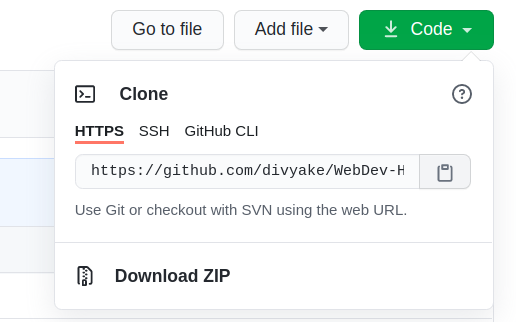
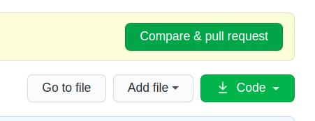
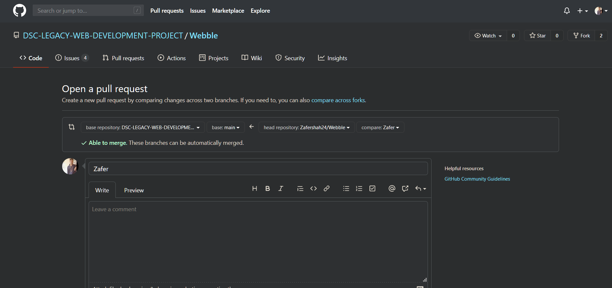

# Contributing Guidelines

This document contains certain rules and guidelines that developers are expected to follow, while contributing to this repository.

---

## For Contributions:

### Step 1: Fork this repository

- A fork would place a copy of this project in your GitHub Account

### Step 2: Clone the repository

- Cloning the repository will place a local copy of project on your own machine
- Copy the URL from the copy to clipboard icon

  
- Open a terminal and run the following git command :

`git clone https://github.com/<your-user-name>/Webble.git`

### Step 3: Create a branch

- A branch is a way to keep your changes separate from the main part of the project called `Master`. For example if things go wrong and you are not happy with your changes you can simply delete the branch and the main project won't be affected.

Change to the repository directory on your computer (if you are not already there):

`cd Webble`

Now create a branch using the `git checkout` command:

`git checkout -b <your-Branch-name>`

### Step 4: Make necessary changes and commit

1. Open your Favourite editor/IDE.

2. Write/Modify  your code.

3. Execute the command `git status`, to see the changes you made.

4. Add those changes to the branch you just created using the `git add` command:

`git add .`

Now commit those changes using the `git commit` command:

`git commit -m "<your message>"`

### Step 5: Push Changes

Push your changes using the command `git push origin <your-branch-name>`

### Step 6: Make a Pull Request

Go to your repository on GitHub, you'll see a `Compare & pull request` button. Click on it.

Now submit the pull request

Congratulations on your new Contribution!

# Important Guidelines.

## 1. Commit Messages

* Use the `-m` flag only for minor changes. The message following the `-m` flag must be of the below format : 
  > `<Verb in present tense> <Action>`
  
  :white_check_mark: __Examples of valid messages:__
  * Added serialisers.py for users app
  * Updated utils/validator.js file
  * Changed functionality of authentication process
  
  :x: __Examples of invalid messages:__
  * Idk why this is not working
  * Only ui bug fixes left
  * All changes done, ready for production :))
  
* Before opening a PR, make sure you squash all your commits into one single commit using `git rebase` (squash). Instead of having 50 commits that describe 1 feature implementation, there must be one commit that describes everything that has been done so far. You can read up about it [here](https://www.internalpointers.com/post/squash-commits-into-one-git).
> NOTE: While squashing your commits to write a new one, do not make use of `-m` flag. In this case, a vim editor window shall open. Write a title for the commit within 50-70 characters, leave a line and add an understandable description.

## 2. Issues
* Issues __MUST__ be opened any time any of the following events occur : 
 1. You encounter an issue such that a major (50 lines of code or above) portion of the code needs to be changed/added.
 2. You want feature enhancements
 3. You encounter bugs
 4. Code refactoring is required
 5. Test coverage should be increased
* __Open issues with the given template only.__
* Feel free to label the issues appropriately.
* Do not remove the headings (questions in bold) while opening an issue with the given template. Simply append to it.

## 3. Branches and PRs

* No commits must be made to the `master` branch directly. The `master` branch shall only consist of the working code.
* Developers are expected to work on feature branches, and upon successful development and testing, a PR (pull request) must be opened to merge with master.
* A branch must be named as either as the feature being implemented, or the issue being fixed. 

  :white_check_mark: __Examples of valid brach names:__
  * #8123 (issue number)
  * OAuth (feature)
  * questionsUtils (functionality of the questions)
  
  :x: __Examples of invalid branch names__:
  * ziyan-testing
  * attemptToFixAuth
  * SomethingRandom

## 4. Discussion Ethics

* Developers should be clear and concise while commenting on issues or PR reviews. If needed, one should provide visual reference or a code snippet for everyone involved to properly grasp the issue.
* Everyone should be respectful of everyone's opinion. Any harsh/disrespectful language is __STRICTLY__ prohibited and will not be tolerated under any circumstances.

## 5. Coding Ethics

* Developers are highly encouraged to use comments wherever necessary and make the code self documented.
* The project structure should be neat and organised. All folders and files should be organised semantically according to their functionality.
*  The name of the folders and files should not be too long but should be as self explanatory as possible.
*  Documentation shall __STRICTLY__ have gender neutral terms. Instead of using "he/him" or "she/her", one should use "they/them" or "the user".

## 6. Coding Style Guidelines

Developers should aim to write clean, maintainable, scalable and testable code. If your code is not testable, that means, it's time to refactor it. The following guidelines might come in handy for this:

* JavaScript: [Airbnb](https://github.com/airbnb/javascript)
* React.JS: [Airbnb](https://github.com/airbnb/javascript/tree/master/react)
